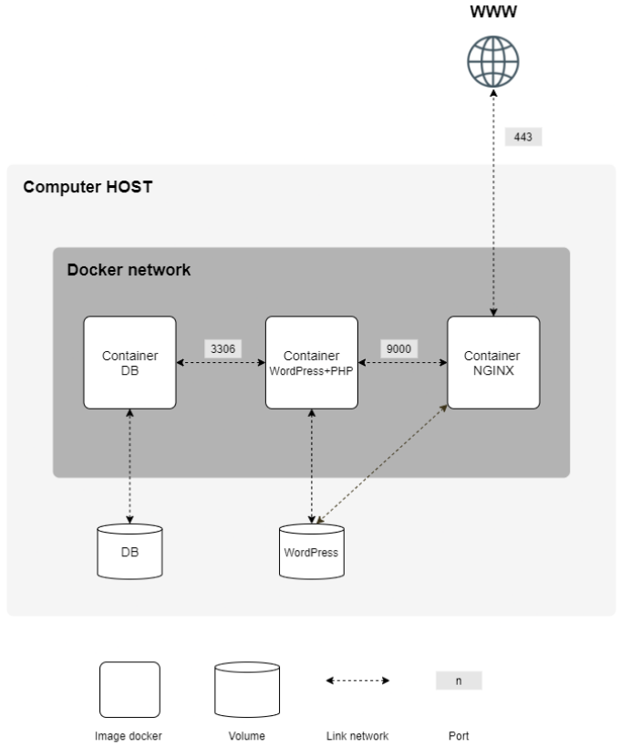

*This project has been created as part of the 42 curriculum by lle-cout.*

- [**Description**](#description)
- [**Instructions**](#instructions)
- [**Resources \& AI Usage**](#resources--ai-usage)
	- [Resources](#resources)
	- [AI Usage](#ai-usage)
- [**Project description**](#project-description)
	- [Design choices](#design-choices)
	- [Comparisons](#comparisons)


# **Description**
This project consists of creating a small infrastructure of docker services to deploy and serve a Website.
We reach this goal by creating containers for each service:
- Nginx as an entrypoint/proxy.
- Wordpress + PHP to manage/generate served pages.
- MariaDB as a Database needed by Wordpress.

These services are orchestrated together through docker compose, thus allowing to manage containers lifecycle as a single unit.
Docker compose also brings two key advantages due to its centralization:
- It helps manage communication between each container via Docker network.
- It sets up persistent storage, allowing to remove dependencies between containers states and Website data.

To have a better understanding of the infrastructure here is a diagram:



# **Instructions**
To run this project you need a UNIX-like system and the following packages:

```bash
git make docker docker-compose
```

You can then clone and cd into the project directory:

```bash
git clone git@github.com:llc-industries/inception.git && cd inception
```

Before building the docker images you need to set your environment with user accounts/password/etc. Otherwise build will fail.
You can call a helper script to do so:

```bash
make env
```

Your website will have the following URL: lle-cout.42.fr.
To access it later you need to append your /etc/hosts file with the following:

```bash
echo '127.0.0.1 lle-cout.42.fr' | sudo tee -a /etc/hosts
```

Now that your environment is set you can start the project!

```bash
make # Build and run
```

Once the build is done, you can access your website [here](https://lle-cout.42.fr). You might get a warning as the cert is self-signed, just ignore it.

You now have 3 options to stop the services:

```bash
make down # Stop the containers
```

```bash
make clean # Stop the containers + delete docker images
```

```bash
make fclean # Stop the containers + delete docker images + delete persistent storage
```

# **Resources & AI Usage**

### Resources

Here is a non-exhaustive list of the resources that helped me to work on this project:
- [Docker documentation](https://docs.docker.com/) -> To understand Dockerfile keywords and best practices
- This [YT Channel](https://www.youtube.com/@cocadmin) (in French) has a few nice videos to understand Docker inner workings
- [MariaDB documentation](https://mariadb.com/docs) -> To setup the db
- [Nginx documentation](https://docs.nginx.com/nginx/admin-guide/basic-functionality/managing-configuration-files/) -> Especially for configuration file
- Many stackoverflow threads -> mostly for bash scripting quirks

### AI Usage

I've used AI to help me the following ways:
- Establish a roadmap / brainstorming
- Recover important info from lengthy logs (build failing...)
- Review some changes, look for different ways to do things
- Review typos in this readme

Note that in my opinion AI should be used as a peer and not as a Worker/Agent, as you would lose your comprehension/learning. \
This may lead to irrecoverable flaws down the way.

# **Project description**

This project uses docker to ensure portability, isolation and potential scalability.

### Design choices
- OS: I chose to build docker images using Alpine linux for two main reasons: [Small memory footprint and security OOTB](https://cimpleo.com/blog/alpine-busybox-and-debian-docker-images-a-comprehensive-guide/)
- Talking about security: Containers are set up with the [least privilege principle](https://en.wikipedia.org/wiki/Principle_of_least_privilege) in mind (e.g mysql user for MariaDB)
- Nginx strictly enforces https with either TLSv1.2 or TLSv1.3 through port 443.
- VM: I've used arch linux as it's quite straightforward to install and bloat-free, and I wanted a small VM (10Go)

### Comparisons

##### **Virtual Machines vs Docker**
A VM emulates hardware to boot a full kernel; emulating hardware is costly and slow compared to containers. A Container shares the host kernel. Docker can be described as a wrapper around Linux syscalls (mostly cgroups and namespaces) to attach constraints to a process group, such as a different filesystem (like a chroot jail), different network configurations, etc. Since a container shares the kernel, its performance and footprint are much lighter than a VM, and execution is instant.

##### **Secrets vs Environment Variables**
Both concepts refer to transferring sensitive information to a container, such as credentials. Passing sensitive data through environment variables simplifies configuration scripts as you can use them directly. However, in certain cases, it can be a security issue: for example, if your service is an API endpoint, a malicious user might be able to dump your env variables and steal your credentials.

Secrets, on the other hand, are more secure as your content is isolated in files where you can handle permissions (e.g., removing read rights when no longer needed).


##### **Docker Network vs Host Network**
Host network shares the host's IP range. While it offers better performance, it may lead to issues such as port conflicts and exposes sensitive services (like the database) to the outside world.

Docker network (used in this project) creates an internal network for the infrastructure, offering a single entrypoint via Nginx (HTTPS), thus strictly isolating other components.

##### **Docker Volumes vs Bind Mounts**
Docker volumes are directly managed by Docker in a specific isolated folder; this allows for good portability. Bind mounts (used in this project) allow mapping a specific container folder to a precise location on the host filesystem, thus easing persistence management as required by the subject.
